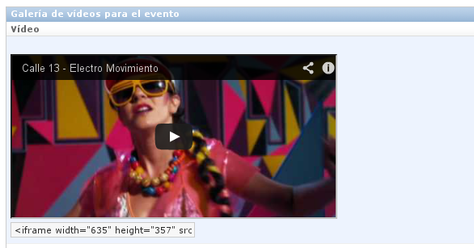

=====================================
Django Events calendar v0.3.6-pre-alpha 
=====================================

Summary
-------
The aim of this project is help developers with basic tasks for 
events publications on a web site.

Dependency Package
------------------
You must install ``django-extensions`` to get this app working well 

Features
--------
Some basic features from this application are:

* Support for multiple web sites using django.contrib.sites.
* Allows to know user authoring.
* Main image for event
* WYSIWYG editor for main content based on tinymce 4.0b3, if you want to set your own
  language visit `tinymce translation page <https://www.transifex.com/projects/p/tinymce/>`_
  and look for your translation and put it on ``static/js/tinymce/langs`` and set your
  language parameter on ``static/js/textarea-events.js`` to::

      tinymce.init({
         language: 'your-language'
      });

  

.. image:: docs/images/main-content.png 
    :alt: Main Content

* Creation date & last update for event.
* Allows to publish and unpublish and event.
* Roadmap with:
    * Event Date.
    * Event Place.
    * Event City.
    * Status Event(Active, Cancelled, Suspended).
* Internationalization support.
* Image Gallery.

.. image:: docs/images/image-gallery.png 
    :alt: Image Gallery

* Video Gallery with youtube previsualization.

* Json string to work with `fullcalendar jQuery plugin <http://arshaw.com/fullcalendar/>`_
  described on `this documentation <http://arshaw.com/fullcalendar/docs/event_data/events_json_feed/>`_::

        [{
             "url": "/eventos/current/9a-y-10a-etapas-del-campeonato-nacional-de-enduro", 
             "start": "2013-06-28", 
             "end": "2013-06-30", 
             "title": "9A Y 10A ETAPAS DEL CAMPEONATO NACIONAL DE ENDURO"
         }, 
         {
             "url": "/eventos/current/racing-bike-capital", 
             "start": "2013-06-23", 
             "end": "2013-06-23",
             "title": "RACING BIKE CAPITAL"
         }, 
         {
             "url": "/eventos/current/campeonato-nacional-nestel-de-supermoto", 
             "start": "2013-06-01", 
             "end": "2013-06-02", 
             "title": "CAMPEONATO NACIONAL NEXTEL DE SUPERMOTO"
         }] 

Here are some samples for Django Events Calendar in action with fullcalendar:

* `Yamaha Terraventura <http://www.yamaha-terraventura.com/seccion/eventos/>`_

* Get summary for:
    * Active events.
    * Inactive events.
    * Last 5 Recent events.
    * Events by site.
    * Events by user.
    * Next events.
    * Past due events.
    * Today events.
    * Events by date.
    * Events by Month.
    * Dates for event.
    * The first & last day for event

If you want to contribute with any kind of corrections or 
request features, feel free to make a fork or send me an email.
