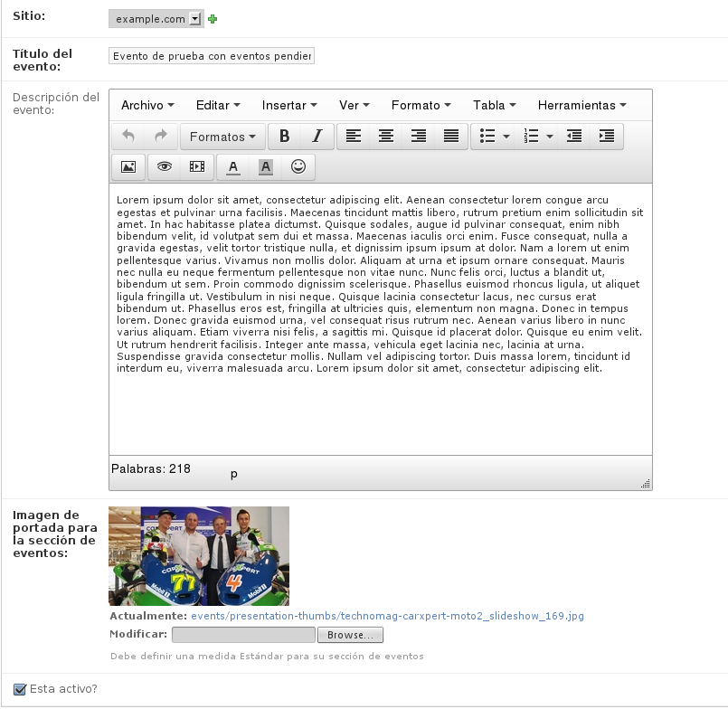
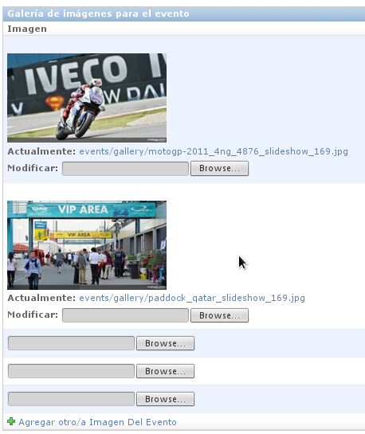

======================
Django Events calendar 
======================

Summary
-------
The aim of this project is help developers with basic tasks for 
events publications on a web site.

Features
--------
Some basic features from this application are:

* Support for multiple web sites using django.contrib.sites.
* Allows to know user authoring.
* Main image for event

* Creation date & last update for event.
* Allows to publish and unpublish and event.
* Roadmap whit:
    * Event Date.
    * Event Place.
    * Event City.
    * Status Event(Active, Cancelled, Suspended).
* Internationalization support.
* Image Gallery.

* Video Gallery.
* Get summary for:
    * Active events.
    * Inactive events.
    * Last 5 Recent events.
    * Events by site.
    * Events by user.
    * Next events.
    * Past due events.
    * Today events.
    * Events by date.
    * Events by Month.
    * Dates for event.

If you want to contribute with any kind of corrections or 
request features, feel free to make a fork or send me an email.
